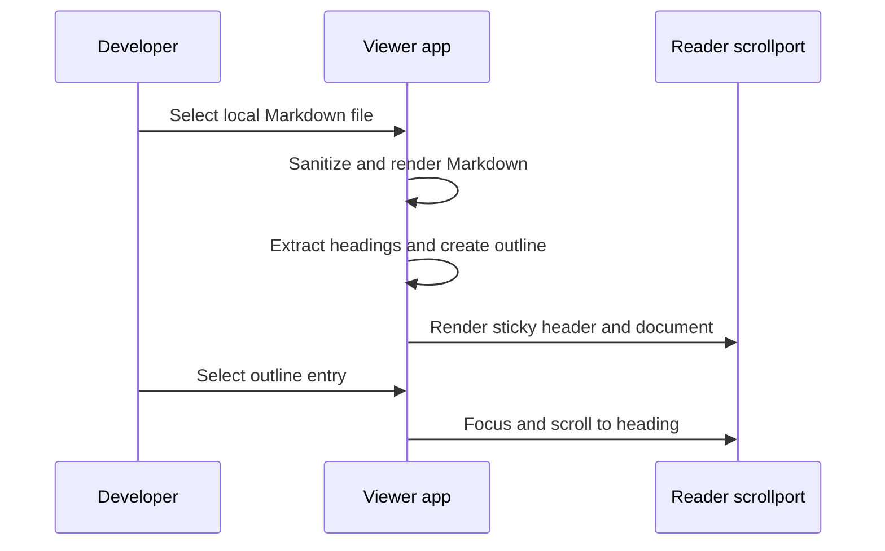

# Add reader header and in-document navigation

## Summary

<!-- Format: State the outcome, scope, and measurable reason for doing this. -->

Add a compact sticky reader header and heading-based outline to the local Spec Viewer. It gives readers the active filename and relative path, plus reliable in-pane navigation for long Markdown specs without changing local-only operation or the existing sidebar.

## Problem

<!-- Format: Describe the current behavior, observed failure/opportunity, affected users, and evidence. -->

The reader currently replaces its document contents with rendered Markdown and gives no persistent indication of which file is open or a way to jump to a section. Developers reading long specs must retain context from the sidebar and scroll manually, even though the reader already has an independent scrollport.

## Goals and Non-Goals

<!-- Format: Use `### Goals` and `### Non-goals` headings, each followed by a Markdown bullet list. Keep each item testable or explicitly bounded. -->

### Goals

- Show the active filename and relative path in a header that remains visible while the reader scrolls.
- Generate an accessible outline from every non-empty H1-H6 heading and scroll the reader to a selected heading.
- Keep the section guidance visible as a sticky right rail on desktop; use a compact toggle and fixed popover only on narrow screens.
- Show one sidebar entry per feature folder and place its available Markdown artifacts in reader tabs.
- Preserve sanitized local Markdown rendering, Mermaid rendering, the sidebar, and independent scrollports.

### Non-goals

- Add reading progress, URL fragments/history, remote content, or new dependencies.

## Users and Scenarios

<!-- Format: Use `### Actors` followed by a Markdown bullet list, then `### Scenarios` followed by a Markdown numbered list. Include the expected result for each scenario. -->

### Actors

- Developers reading local MSDD specification files in the browser viewer.

### Scenarios

1. A developer opens a file; the reader header shows its filename and relative path and remains visible while the document scrolls.
2. A developer opens the outline; nested heading labels identify available sections and selecting one moves focus and the reader to that section.
3. A developer on desktop keeps the floating right rail visible while reading; on a narrow screen the compact control exposes the outline without permanently reducing the document width.
4. A file has no non-empty headings; the reader stays usable and does not offer an empty outline.
5. A developer selects a feature in the sidebar; the viewer opens its preferred spec document and exposes Explore, Spec, and Tasks tabs when those files exist.

## Requirements

<!-- Format: Use stable IDs such as REQ-001. For each requirement state the behavior, inputs/outputs, and priority. -->

- REQ-001 (high): On each successful file selection, render a reader header from file.relativePath; output filename as title and full relative path as secondary text.
- REQ-002 (high): Keep the header sticky within #reader without restoring document-level scrolling or changing sidebar behavior.
- REQ-003 (high): From sanitized rendered content, collect non-empty H1-H6 in document order, create deterministic collision-free heading IDs, and expose their text and level in an outline.
- REQ-004 (high): The outline toggle shall be keyboard operable, identify its expanded state and controlled content, close with Escape, and move reader focus and scroll to the selected heading with motion respecting user preferences.
- REQ-005 (medium): Present the outline as a sticky right rail on desktop and a compact mobile popover on narrow screens; hide or disable it when no headings exist.
- REQ-006 (high): Preserve render failure recovery, sanitized Markdown, Mermaid behavior, local-only operation, and no new runtime dependency.
- REQ-007 (medium): Update the package version before release verification and commit all scoped changes in one final commit.
- REQ-008 (high): Group local Markdown files by feature folder for sidebar navigation. Selecting a group shall open its preferred document and render tabs for its available artifacts, ordered Explore, Spec, Tasks, then other files alphabetically.

## User/System Flows

<!-- Format: Use numbered steps. Name the actor, system action, state change, and failure branch at each relevant step. -->

1. Developer selects a feature folder; the system marks one sidebar entry current and selects that feature’s `spec.md` when it exists, otherwise its first Markdown file.
2. System parses and sanitizes Markdown, creates the reader header and document container, then inserts the safe rendered content.
3. System collects valid headings, assigns IDs, and renders the outline; if none exist, it hides the outline control.
4. Developer opens the control; the system sets its expanded state and presents the responsive outline.
5. Developer selects a document tab; the system replaces the reader content while retaining the active feature context and regenerates the outline.
6. Developer chooses an outline entry; the system closes the mobile control when applicable, scrolls the #reader scrollport to the target, and focuses the heading.
7. Mermaid rendering completes or displays its existing per-block fallback; if file rendering fails, the system replaces reader content with the existing recoverable error.

## Technical Design

<!-- Format: Describe components, interfaces, data, dependencies, compatibility, security, and operational concerns. -->

### Solution Description

Extend the client-only selection render path. It builds a stable reader shell, then derives navigable heading metadata from the sanitized document DOM. On desktop, the reader layout keeps the outline in a sticky right rail. On narrow screens, the header owns the compact outline control. A chosen item controls the existing #reader scrollport.

### Current State

#reader is both the content root and independent vertical scrollport. selectFile injects sanitized marked output directly and then replaces Mermaid code blocks asynchronously.

### Proposed Design

Keep #reader as the scroll container. Add header, document-content, and outline-panel elements per successful selection. Build IDs and outline after safe HTML insertion, before Mermaid replacement. A desktop grid places the content beside a sticky rail. At the existing narrow breakpoint, the grid becomes one column and the panel becomes a compact fixed popover controlled by the header. Recreate all reader-owned elements on every selection. Preserve a unique safe pre-existing heading ID; otherwise derive a collision-free ID from the displayed heading label.

### Architecture / Components

- index.html supplies stable reader landmarks and initial empty content.
- tree.js groups files into feature-folder entries; app.js renders feature navigation, artifact tabs, reader shell, disclosure and focus handlers, and selection orchestration.
- server.js adds the viewer route for the new browser module.
- styles.css provides sticky-header, outline, heading nesting, desktop popover, and mobile compact styles.

### Data Model / API Changes

None. Ephemeral heading objects contain id, text, and level. No URL, persistence, server route, or dependency changes.

Feature navigation groups contain a feature `path`, display `name`, and its sorted local files. They exist only in the browser session.

### Technical Decisions

Use filename plus relative path, all non-empty H1-H6 headings, deterministic unique IDs, and no URL fragments. Use a sticky desktop rail for persistent orientation, with native buttons and ARIA disclosure, Escape close, and focus restoration only when the mobile popover is active. Respect reduced motion.

Use feature folders, not individual Markdown files, as the sidebar’s navigation unit. Prefer `spec.md` for the initial tab and preserve a stable Explore, Spec, Tasks tab order.

### Trade-offs

A persistent rail improves scanning and matches the established reading pattern, but takes a bounded right column on wide screens. The mobile layout deliberately keeps the document full-width and uses a compact popover. Fresh DOM per selection keeps state simple but does not retain open mobile-popover state across files.

### Failure Handling

If Markdown parsing or file reading fails, retain the existing reader error. If no headings survive, omit the outline. Preserve existing Mermaid block fallback independently of outline creation.

### Testing Strategy

Unit-test heading metadata and unique IDs where extracted. Add source or DOM assertions for semantic header, ARIA control, sticky and responsive CSS, and run node tests plus package check.

## Decisions and Constraints

<!-- Format: Use `### Confirmed Decisions`, `### Assumptions`, `### Constraints`, and `### Open Questions` headings, each followed by Markdown bullets. Do not hide unresolved choices. -->

### Confirmed Decisions

- Use a floating sticky right rail on desktop, a header-controlled mobile popover, filename title plus relative path, all non-empty H1-H6 headings, no progress, and no URL fragments.
- Use a single sidebar button per feature folder and reader-local artifact tabs.
- Update version and commit all changes as the final closing phase.

### Assumptions

- DOM APIs needed for focus, scroll, and media query behavior are available in supported browsers.

### Constraints

- Keep static localhost serving, offline bundled dependencies, sanitized Markdown, existing Mermaid behavior, 100dvh shell, and independent panes.
- Do not add dependencies; keep the desktop rail bounded and switch it off structurally at the existing narrow breakpoint.

### Open Questions

- None for this specification.

## Edge Cases and Failure Handling

<!-- Format: Use a case/action table or bullets with trigger, expected behavior, recovery, and user-visible error. -->

- File has no headings or only whitespace headings: Render header and content; hide the outline control.
- Duplicate, punctuation-only, or repeated heading labels: Generate unique stable IDs and usable outline labels without throwing.
- Outline is open when another file is selected: Replace the reader shell and start closed for the new file.
- Escape is pressed: Close the outline and restore focus to its toggle.
- Heading selection cannot receive focus normally: Assign temporary programmatic focusability, focus it, and retain readable scroll position.
- File, parse, sanitize, or Mermaid failure: Preserve the existing reader or diagram-specific fallback; do not leave stale header or outline data.
- Narrow viewport or reduced motion: Keep controls operable in the compact layout and avoid forced smooth motion.

## Acceptance Criteria

<!-- Format: Use stable IDs such as AC-001. Make each criterion observable and state how it will be verified. -->

- AC-001: Selecting any Markdown file shows its basename and relative path in a sticky reader header; verify with DOM behavior and CSS tests.
- AC-002: A document with multiple headings produces an ordered, level-indented outline; every entry targets one unique heading ID; verify with helper or DOM tests.
- AC-003: Keyboard users can open the outline, select an item, reach the target, and close it with Escape; verify with focused interaction tests or documented manual check.
- AC-004: The outline is a sticky right rail on desktop and a compact fixed popover at the mobile breakpoint; verify stylesheet assertions and responsive manual check.
- AC-005: A heading-free document, duplicate heading text, render failure, and Mermaid failure preserve usable reader fallback behavior; verify automated cases where practical.
- AC-006: npm test and npm run package:check pass after the version update; the final git commit includes all intended scoped changes and no unrelated files.
- AC-007: A feature with `explore.md`, `spec.md`, and `task.md` appears once in the sidebar; selecting it opens Spec first and displays each existing artifact as a tab; verify helper and reader tests.

## Explanation and Output Artifacts

<!-- Format: Use a Markdown bullet list with separate `Audience:`, `Writing profile:`, `Primary artifact:`, `Supporting artifacts:`, and `Accessibility:` fields. Prefer an 80% ASD-STE100 controlled-language style for explanatory prose unless strict ASD-STE100 or plain language is required. Choose the clearest medium: prose, diagram, interactive HTML, or narrated explainer video. State the topic, purpose, interaction or narration needs, delivery location, and acceptance evidence for each requested artifact. -->

- Audience: Maintainers and developers who run the local MSDD Spec Viewer.
- Writing profile: 80% ASD-STE100 controlled-language style.
- Primary artifact: The implemented reader header and interactive outline in src/viewer; it explains itself through visible filename, path, and section labels. Acceptance evidence is the passing suite and manual reader check.
- Supporting artifacts: This specification and automated tests document the layout, interaction, and release evidence. No separate prose guide, diagram artifact, or video is required.
- Accessibility: Use semantic landmarks, visible text labels, keyboard-operated controls, ARIA expanded and controls linkage, Escape close, focus movement, and reduced-motion-respecting scroll behavior.

## Implementation Plan

<!-- Format: Use ordered, independently verifiable tasks. Include dependencies and the files or boundaries affected. -->

1. Create and test isolated heading metadata and ID helpers in src/viewer/app.js or a focused viewer module; cover empty, duplicate, and punctuation-only text before wiring DOM behavior.
2. Update src/viewer/index.html, src/viewer/app.js, and src/server.js to render and serve the semantic reader header, document container, heading outline, disclosure interactions, focus and scroll behavior, and retained failure paths; depends on task 1.
3. Update src/viewer/styles.css for sticky header, compact outline, heading nesting, mobile presentation, and reduced-motion behavior while preserving existing scrollports; depends on task 2.
4. Add or extend viewer tests for helper output, semantic and ARIA markup, sticky and responsive CSS, and error and heading-free behavior; depends on tasks 1-3.
5. Run npm test, npm run package:check, and responsive or manual reader checks; resolve feature defects; depends on task 4.
6. As the final closing phase, update package.json and package-lock.json version as required, rerun release checks, inspect git status and diff, and create one git commit containing all and only the scoped feature, spec, test, and version changes; depends on task 5.
7. Replace the desktop outline popover with a sticky right rail while retaining the compact mobile disclosure, and update focused reader/style tests; depends on task 6.
8. Update viewer navigation to group sidebar entries by feature folder and render ordered artifact tabs in the reader, with focused tree and reader tests; depends on task 7.

## Verification and Implementation Notes

<!-- Format: List commands/tests, expected evidence, rollout checks, and a place to record deviations. -->

Evidence: Run `npm test`, `npm run package:check`, responsive reader checks, `git diff --check`, and scoped status/staged-diff inspection during the implementation-plan verification task. The final closing task updates the version, reruns release checks, records deviations, and creates the one scoped commit only after all other work is complete.

Evidence: `node --test test/headings.test.js` passed 2 tests after adding the dependency-free `src/viewer/headings.js` helpers. The helpers normalize labels to readable slugs, use `section` for punctuation-only headings, omit whitespace-only headings, and suffix repeated IDs deterministically.

Evidence: `node --check src/viewer/app.js && node --test test/headings.test.js test/tree.test.js` passed. The render path now creates a fresh reader header and document container for each selected file, constructs the outline from sanitized headings before Mermaid replacement, preserves unique valid IDs, closes on Escape or outside pointer interaction, and uses reader-relative focus and scrolling.

Evidence: `node --test test/viewer-style.test.js && node --check src/viewer/app.js` passed. The header is sticky against the reader scrollport, heading targets have header-aware scroll margins, the outline is an anchored compact panel, and the 700px rule converts its presentation for narrow screens without changing the independent pane geometry.

Evidence: The static server uses an explicit route allowlist, so `src/server.js` and the package manifest check now include `headings.js`. `node --test test/server.test.js test/headings.test.js && node --check src/viewer/app.js` passed 6 tests and confirms the browser can request the new module.

Evidence: `node --test test/headings.test.js test/server.test.js test/viewer-reader.test.js test/viewer-style.test.js` passed 12 tests. The coverage verifies heading output, served module access, the labelled reader landmark, ARIA disclosure hooks, Escape and focus behavior, heading-free conditional rendering, both failure paths, sticky context, responsive compact layout, and reduced-motion CSS.

Evidence: `npm test` passed 29 tests, `npm run package:check` produced a valid 0.4.2 package with 21 files, and `git diff --check` passed. A local server returned the reader landmark, `app.js`, and `headings.js` successfully. Browser-based folder selection could not be exercised because no computer-use browser was available in this environment; responsive and interaction contracts are covered by the focused automated tests above.

Evidence: Version updated from 0.4.2 to 0.4.3 in package.json and package-lock.json. Final `npm test` passed 29 tests, `npm run package:check` validated the 0.4.3 package with 21 files, `git diff --check` passed, and `msdd review` passed. The final scoped diff and status were inspected before committing.

Evidence: The desktop outline was refined after release into a floating sticky right rail based on the supplied reference. `node --check src/viewer/app.js && node --test test/viewer-reader.test.js test/viewer-style.test.js && git diff --check` passed 6 focused tests. The desktop rail keeps “On this page” continuously visible without a shadow; the compact mobile popover remains available at 700px and below.

Evidence: The viewer navigation was reshaped to show one sidebar entry per feature folder and reader-local Explore, Spec, and Tasks tabs. `npm test` passed 31 tests and `git diff --check` passed after adding feature grouping and tab-order coverage.
