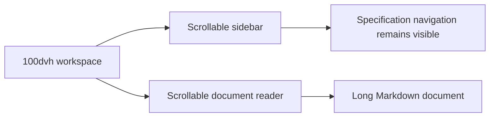

# Create independent scrolling regions

## Summary

<!-- Format: State the outcome, scope, and measurable reason for doing this. -->

Make the active Local Spec Viewer workspace a fixed 100dvh application shell with independent sidebar and document-reader scrolling. This keeps specification navigation available while a developer reads long Markdown content at desktop and mobile widths.

## Problem

<!-- Format: Describe the current behavior, observed failure/opportunity, affected users, and evidence. -->

The full-viewport workspace currently uses min-height:100vh. Long reader content expands the grid and moves scrolling to the browser page, so the sidebar scrolls away with the document. The sidebar and reader have no independent, bounded scrollports.

## Goals and Non-Goals

<!-- Format: Use two labeled lists: Goals and Non-goals. Keep each item testable or explicitly bounded. -->

### Goals
- Lock the visible workspace to 100dvh.
- Provide separate vertical scrolling for the sidebar and reader.
- Keep the selected navigation and sidebar available while the reader scrolls.
- Preserve independent scrolling in the stacked layout at 700px and below.

### Non-goals
- Redesign navigation content, Markdown rendering, typography, or folder selection.
- Change the desktop 260px sidebar rail, reader 74ch measure, paper surfaces, or sidebar divider.
- Add JavaScript state, dependencies, APIs, or data storage.

## Users and Scenarios

<!-- Format: List actors and numbered scenarios. Include the expected result for each scenario. -->

### Actors
- Developer: opens the local MSDD Spec Viewer and reads specifications.

### Scenarios
1. A developer opens a long specification on a desktop viewport; the workspace stays exactly viewport height, the reader scrolls, and the sidebar remains visible.
2. A developer scrolls a long specification tree; the sidebar scrolls without moving the reader content.
3. A developer narrows the viewport to 700px or below; the sidebar and reader use bounded stacked rows, and either pane can scroll without moving the other.
4. A developer views wide Markdown tables or code; their existing local horizontal overflow behavior remains available without causing page-level vertical scrolling.

## Requirements

<!-- Format: Use stable IDs such as REQ-001. For each requirement state the behavior, inputs/outputs, and priority. -->

- REQ-001: The visible application and workspace shells must use a definite height of 100dvh and must not expand vertically because of sidebar or reader content. Priority: high.
- REQ-002: The application and workspace shells must prevent page-level vertical overflow so vertical scrolling occurs only in the sidebar and reader panes. Priority: high.
- REQ-003: The desktop sidebar and reader grid items must be shrinkable and independently vertically scrollable. Priority: high.
- REQ-004: At 700px and below, the single-column workspace must use bounded grid rows so both the stacked sidebar and reader remain independently vertically scrollable within 100dvh. Priority: high.
- REQ-005: The implementation must retain the 260px desktop rail, sidebar divider, reader 74ch content measure, paper surfaces, semantic HTML, and existing Markdown rendering behavior. Priority: high.
- REQ-006: Existing reader code-block and table overflow behavior must remain usable. Priority: medium.

## User/System Flows

<!-- Format: Use numbered steps. Name the actor, system action, state change, and failure branch at each relevant step. -->

1. Browser loads the viewer and the user selects a project folder.
2. The client reveals the existing workspace section without changing its shell height.
3. CSS constrains the workspace to 100dvh and its grid tracks to available space.
4. The sidebar and reader each receive their own scrollport; scrolling either pane does not alter the other pane position.
5. At the 700px breakpoint, CSS replaces the desktop columns with bounded sidebar and reader rows; each row remains scrollable.
6. If Markdown content exceeds the reader width, existing nested code-block or table overflow handles it locally rather than expanding the viewport.

## Technical Design

<!-- Format: Describe components, interfaces, data, dependencies, compatibility, security, and operational concerns. -->

### Solution Description
Update only `src/viewer/styles.css`. Replace the application and workspace minimum heights with definite `100dvh` heights while retaining clipping boundaries. Keep the status message out of normal layout so it remains visible without extending the document. Give `aside` and `#reader` `min-height:0` and vertical scrolling so grid items can shrink and own their scrollports. At the 700px breakpoint, replace the unconstrained single-row grid with two bounded rows so the stacked panes also have independent scrollports. The key decision is to preserve both panes as scroll regions on small screens rather than allowing the sidebar to take natural page height.

### Current State
`.workspace` is a two-column grid with `min-height:100vh` and `overflow:hidden`. `aside` and `#reader` do not define a height or vertical overflow, so a long document grows the workspace and the browser page becomes the scroll container. The 700px breakpoint changes the grid to one unconstrained column. The status paragraph follows the workspace in normal document flow, so it can create a page-level scroll range even after the workspace is fixed.

### Proposed Design
Use `height:100dvh` and clipping on the application shell and active workspace. Position the existing status message outside normal layout so it stays visible without increasing document height. Set `min-height:0` and `overflow-y:auto` on both pane grid items. In the existing small-screen media query, define two bounded row tracks that fit within the workspace and keep the same pane scroll rules. Preserve reader padding and existing nested horizontal overflow for tables and code blocks.

### Architecture / Components
- `src/viewer/styles.css`: owns application/workspace sizing, status-message placement, desktop grid items, scrollports, and responsive grid rows.
- `src/viewer/index.html`: retains the existing semantic `aside`, `nav`, and `article` structure.
- `src/viewer/app.js`: unchanged; it continues to render selected Markdown into `#reader`.

### Data Model / API Changes
None.

### Technical Decisions
- Use `100dvh`, not `100vh`, so the application shell follows mobile browser dynamic viewport changes.
- Remove the global status message from normal layout so it does not create a document scroll range outside the pane scrollports.
- Use CSS Grid sizing with `min-height:0` to allow both grid items to shrink rather than force the grid to expand.
- Apply pane-owned vertical overflow at desktop and at the existing stacked breakpoint.

### Trade-offs
- On small screens, each pane receives a bounded portion of the viewport instead of the sidebar expanding to its full natural height. This keeps both panes accessible without page scrolling, but can require a user to scroll the sidebar to see all navigation.
- A CSS-only solution avoids state and rendering changes, but requires browser checks because stylesheet assertions cannot prove actual scroll isolation.

### Failure Handling
This CSS-only feature has no runtime error path. Use `min-height:0` on grid items to prevent oversized content from defeating the scrollports. Keep the status message visible without letting it create document overflow. Retain local overflow handling for reader code blocks and tables to prevent wide content from creating unintended viewport overflow.

### Testing Strategy
Add focused stylesheet assertions for the 100dvh application/workspace shells, status-message placement, pane `min-height:0` and vertical overflow, and bounded mobile grid rows. Run the full Node test suite. Manually inspect long sidebar and document content at desktop and at 700px or below; confirm each pane scrolls independently and the page itself does not vertically scroll.

## Decisions and Constraints

<!-- Format: Separate Confirmed decisions, Assumptions, Constraints, and Open questions. Do not hide unresolved choices. -->

### Confirmed Decisions
- The active workspace is locked to 100dvh.
- Sidebar and reader scroll independently.
- Navigation stays visible while a long document is read.
- At 700px and below, both stacked panes remain independently scrollable within the workspace.

### Assumptions
- The landing state remains governed by its existing viewport sizing because it has no reader or sidebar.
- The existing workspace `overflow:hidden` remains the appropriate page-level clipping boundary.

### Constraints
- Limit implementation to CSS unless verification exposes a markup limitation.
- Preserve the full-width shell, 260px desktop rail, reader measure, semantic structure, and existing 700px breakpoint.

### Open Questions
- None.

## Edge Cases and Failure Handling

<!-- Format: Use a case/action table or bullets with trigger, expected behavior, recovery, and user-visible error. -->

- **Long reader document:** The reader scrolls within its own pane; the sidebar position does not change.
- **Long navigation tree:** The sidebar scrolls within its own pane; the reader position does not change.
- **Small viewport:** Bounded stacked grid rows keep both panes inside 100dvh and independently scrollable.
- **Wide code block or table:** Existing nested overflow remains available and must not restore browser-page vertical scrolling.
- **Dynamic mobile browser chrome:** `100dvh` updates the shell height as the visual viewport changes.

## Acceptance Criteria

<!-- Format: Use stable IDs such as AC-001. Make each criterion observable and state how it will be verified. -->

- AC-001: With long reader content at desktop width, the workspace computes to 100dvh and the browser page does not become the vertical scroll target; the reader scrolls independently.
- AC-002: With long navigation content at desktop width, the sidebar scrolls independently and remains visible while reader content is scrolled.
- AC-003: At 700px and below, the workspace retains a 100dvh boundary and both stacked panes can independently scroll.
- AC-004: The desktop rail width, sidebar divider, reader measure, reader padding, paper surfaces, code-block overflow, and table overflow remain intact.
- AC-005: Focused stylesheet checks and `npm test` pass; manual browser checks document scroll isolation at desktop and mobile widths.

## Explanation and Output Artifacts

<!-- Format: Use labeled fields: Audience, Writing profile, Primary artifact, Supporting artifacts, and Accessibility. Prefer an 80% ASD-STE100 controlled-language style for explanatory prose unless strict ASD-STE100 or plain language is required. Choose the clearest medium: prose, diagram, interactive HTML, or narrated explainer video. State the topic, purpose, interaction or narration needs, delivery location, and acceptance evidence for each requested artifact. -->

- Audience: Developers who use and maintain the local MSDD Spec Viewer.
- Writing profile: 80% ASD-STE100 controlled-language technical prose.
- Primary artifact: CSS changes in `src/viewer/styles.css`; they create fixed-height, independently scrollable viewer panes.
- Supporting artifacts: This specification, the generated task list, focused stylesheet tests, and manual viewport verification evidence.
- Accessibility: Keep semantic navigation and article elements, preserve keyboard scrolling and focus visibility, avoid hidden content, and maintain readable reader line length.

## Implementation Plan

<!-- Format: Use ordered, independently verifiable tasks. Include dependencies and the files or boundaries affected. -->

1. Update `src/viewer/styles.css` to use a definite `100dvh` workspace height while retaining the full-width shell and its page-level clipping boundary.
2. Update desktop `aside` and `#reader` styles with shrinkable grid-item sizing and independent vertical overflow, without changing the rail, divider, reader measure, or local Markdown overflow rules.
3. Update the existing 700px media rule to use bounded sidebar and reader row tracks so both stacked panes independently scroll within the 100dvh workspace.
4. Add focused stylesheet assertions for shell height, pane scroll behavior, and bounded responsive rows.
5. Update `src/viewer/styles.css` so the existing status message stays visible without extending the application document beyond the 100dvh shell; add a focused assertion and repeat scroll-isolation verification.
6. Run automated tests and manually verify long navigation and document scrolling at desktop and small-screen widths; record evidence and deviations in this specification.

## Verification and Implementation Notes

<!-- Format: List commands/tests, expected evidence, rollout checks, and a place to record deviations. -->

- Run `npm test`; expected result: all existing and new focused tests pass.
- Inspect computed styles at a desktop viewport; expected result: workspace height is 100dvh, both grid items have `min-height:0` and vertical auto overflow, and the browser page does not vertically scroll for long content.
- Inspect at 700px and below; expected result: the workspace uses bounded stacked rows and both panes scroll independently.
- Inspect a long Markdown code block and table; expected result: their local overflow behavior remains usable.
- Record test output, browser-check evidence, and any deviation after implementation.
- Evidence: T1 replaced the workspace `min-height:100vh` with `height:100dvh` while retaining its `width:100%` shell and `overflow:hidden` clipping boundary on 2026-10-10.
- Evidence: T2 added `min-height:0` and `overflow-y:auto` to the desktop sidebar and reader grid items on 2026-10-10, without altering the 260px rail, divider, reader measure, padding, or nested code-block and table overflow rules.
- Evidence: T3 added bounded `minmax(0,2fr) minmax(0,3fr)` sidebar and reader grid rows to the existing 700px media rule on 2026-10-10. The base pane scroll rules apply unchanged to the stacked layout.
- Evidence: T4 added a focused stylesheet test for the 100dvh workspace, both shrinkable vertical scrollports, and bounded responsive rows. `node --test test/viewer-style.test.js` passed 2 of 2 tests on 2026-10-10.
- Evidence: T5 desktop browser verification found that the workspace and reader had the intended 100dvh and independent vertical scrolling, but the normal-flow status paragraph added 21px of document-level overflow. The implementation plan now includes a CSS-only correction before final verification.
- Evidence: T15 made `.app` a clipped, positioned 100dvh shell and positioned `.message` at its bottom outside normal layout. The focused stylesheet test now asserts both rules and passed 2 of 2 tests on 2026-10-10.
- Evidence: T5 final browser verification passed on 2026-10-10. At desktop, the 873px workspace had reader `overflow-y:auto` and a reader scroll range with no document-level vertical scroll. At a 700px-wide, 800px-high viewport, the bounded rows resolved to 320px and 480px; the sidebar (569px content in a 319px client area) and reader (6539px content in a 480px client area) both had independent scroll ranges, with no document-level vertical scroll. The temporary viewport override was reset.
- Evidence: T6 `npm test` passed all 23 tests on 2026-10-10 after the final shell and status-message changes.
- Evidence: T7 desktop computed-style inspection passed on 2026-10-10: the workspace was 873px (the active 100dvh viewport), both pane elements used `overflow-y:auto`, the reader had a vertical scroll range, and the document had no vertical scroll range.
- Evidence: T8 responsive inspection passed on 2026-10-10 at 700px wide by 800px high. The workspace resolved to bounded 320px and 480px rows; both sidebar and reader had independent scroll ranges, and the document had no vertical scroll range.
- Evidence: T9 used a focused CSS assertion on 2026-10-10 to confirm the preserved `#reader pre { overflow:auto; }` and `#reader table { border-collapse:collapse; width:100%; }` rules. The repository has no existing viewer fixture with a rendered table or non-Mermaid fenced code block, so no fixture-driven browser check was added to this CSS-only scope.
- Evidence: T10 recorded the full-suite result, focused stylesheet checks, desktop and responsive browser checks, and the status-message overflow deviation and correction. No unresolved deviations remain.
