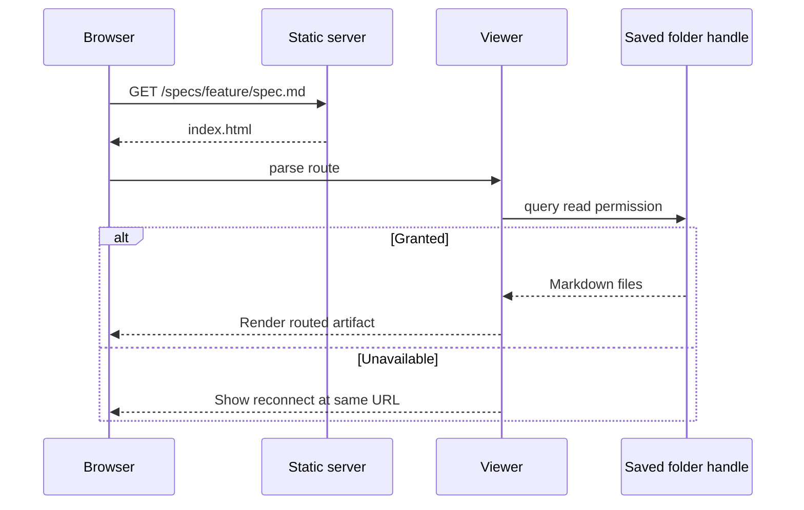

# Deep-linked spec pages

## Summary

Give each locally viewed specification artifact a pathname URL and restore it after refresh when its saved folder handle remains readable. Make the workspace MSDD brand a Home link.

## Problem

The viewer has only `/`; file selection does not change the address, so refresh recreates landing. The sidebar MSDD brand is non-interactive.

## Goals and Non-Goals

### Goals

- Give every selected Markdown artifact a deterministic encoded pathname URL.
- Restore a routed artifact from the most-recent readable directory handle.
- Preserve a deep URL and show recovery when permission or data is unavailable.
- Make MSDD an accessible Home link that preserves recent folders.

### Non-goals

- Expose local filesystem paths, restore directory uploads, change rendering, or add server data.

## Users and Scenarios

### Actors

- Developer: reads a local project specification in the MSDD viewer.

### Scenarios

1. Selecting a feature or artifact gives the browser its canonical document URL.
2. Refreshing that URL with a readable handle renders the same artifact.
3. A handle needing permission retains the URL and offers reconnect recovery.
4. Following Home returns to landing and shows recent folders.

## Requirements

- REQ-001: Feature and artifact selection must create a reversible encoded `/specs/` pathname from `feature.path` and `file.relativePath`. Priority: high.
- REQ-002: Valid viewer document-route GET requests must return `index.html`; explicit assets and non-GET requests retain restricted behavior. Priority: high.
- REQ-003: Direct load, refresh, Back, and Forward must resolve routes without adding history. Priority: high.
- REQ-004: Startup must use the most-recent saved handle when it has read permission and render the matched file without saving again. Priority: high.
- REQ-005: Missing history, permission, route, feature, or file must keep the requested URL and show actionable recovery. Priority: high.
- REQ-006: MSDD must be a keyboard-accessible link to `/`; Home keeps recent-folder history. Priority: high.

## User/System Flows

1. The developer selects a folder; the client indexes files, saves its handle, and selects an artifact.
2. The client encodes the selection as a `/specs/` route and pushes it only for user navigation.
3. On reload, the server returns the shell and the client parses the pathname.
4. With granted permission, the client indexes the saved folder and renders the matched artifact without history mutation.
5. Without permission or data, the client keeps the URL and shows reconnect or folder-selection recovery.
6. On `popstate`, the client resolves the current route; Home is a normal link to `/`.

## Technical Design

### Solution Description

Add a pure route module that serializes feature/file paths to `/specs/...` and safely parses them. Route-aware selection has `push` and `none` modes. The client restores from the most-recent IndexedDB handle only after a non-prompting permission check. The server provides a constrained fallback for document routes. Pathnames, not hashes, give each artifact its own page.

### Current State

`app.js` has no URL state; `server.js` serves exact static paths; `history.js` has persisted handles but no most-recent accessor.

### Proposed Design

Encode each URL segment and reject malformed, empty, traversal-like, or non-Markdown routes. Add route matching over built features. Parse startup and popstate routes, ignore stale async completions, and request permission only after reconnect activation. Keep invalid routes visible and recoverable.

### Architecture / Components

- `src/viewer/routes.js`: route creation, parsing, and feature/file matching.
- `src/viewer/history.js`: most-recent-record accessor.
- `src/viewer/app.js`: selection modes, restoration, recovery, and `popstate`.
- `src/viewer/index.html` and `styles.css`: Home anchor and recovery UI.
- `src/server.js`: validated document-route fallback.

### Data Model / API Changes

IndexedDB remains `{ name, handle, usedAt }`. The URL contract is `/specs/<encoded feature segments>/<encoded file segments>`. No server API or filesystem path exposure is added.

### Technical Decisions

Use pathname routing and `history.pushState`; do not request permission on page load. Allow fallback only below `/specs/` so unknown assets remain 404.

### Trade-offs

Pathnames need server fallback but meet the page and refresh goals. Automatic restore works only for File System Access handles; uploads remain session-only.

### Failure Handling

No history, permission loss, unreadable folder, malformed route, missing document, and stale navigation retain the URL and show recovery rather than redirecting Home.

### Testing Strategy

Unit-test routes and history access. Test server fallback and 404 boundaries. Cover selection, restoration, recovery, Home, and popstate in viewer tests.

## Decisions and Constraints

### Confirmed Decisions

- Use pathname URLs, server fallback, last-readable-handle restoration, reconnect recovery, and a normal Home link.

### Assumptions

- A File System Access directory handle remains structured-cloneable in IndexedDB and paths are stable within a selected folder.

### Constraints

- Browser permission can be revoked; filesystem paths must never enter URLs; uploads have no persistent handle.

### Open Questions

- None. Nonstandard filenames use encoded relative paths.

## Edge Cases and Failure Handling

| Trigger | Expected behavior and recovery |
| --- | --- |
| No saved handle | Keep URL; explain that a project folder is needed and offer selection. |
| Permission prompt or denial | Keep URL; show reconnect; ask only after activation. |
| Folder lacks `specs` | Keep URL; show invalid-folder recovery. |
| Bad or unmatched route | Keep URL; show invalid/document-not-found recovery. |
| Async Back/Forward race | Ignore stale completion or re-resolve current route. |
| Unknown static asset | Return 404, not the shell fallback. |

- Recovery preserves the original route so the developer can reconnect or choose a valid project without losing context.

## Acceptance Criteria

- AC-001: Selecting features and artifacts creates deterministic `/specs/` URLs. Verify with route and viewer tests.
- AC-002: A valid document route returns viewer HTML with 200, while unknown assets remain 404. Verify with server tests.
- AC-003: Refresh with a granted saved handle renders the same feature and artifact without navigating to `/`. Verify with controlled client test.
- AC-004: Missing/revoked handles preserve the deep URL and show recovery. Verify with viewer tests.
- AC-005: Back/Forward select routed artifacts without duplicate history. Verify with history-event tests.
- AC-006: MSDD is a keyboard-accessible Home link and Home preserves recent folders. Verify markup and interaction tests.

## Explanation and Output Artifacts

- Audience: Developers who use and maintain the local MSDD viewer.
- Writing profile: 80% ASD-STE100 controlled-language technical prose.
- Primary artifact: This specification and its sequence diagram explain restoration, permission recovery, and Home behavior; delivery is this feature folder; acceptance evidence is the requirement-to-test mapping.
- Supporting artifacts: `task.md` plus focused route, history, server, viewer, and recovery tests.
- Accessibility: Home is a semantic anchor with visible focus; recovery controls are keyboard reachable and status messages use current live-region conventions.

## Implementation Plan

1. Create and test `src/viewer/routes.js` pathname helpers for encoding, parsing, validation, and feature/file resolution; no dependencies.
2. Extend `src/viewer/history.js` with tested most-recent-record access for restoration; depends on task 1 only for its consumer contract.
3. Update `src/server.js` and tests for validated `/specs/` GET fallback while retaining asset and non-GET 404 restrictions; independent of tasks 1 and 2.
4. Update `src/viewer/app.js` for route-aware selection, startup restoration, reconnect recovery, stale-load protection, and popstate; depends on tasks 1 and 2.
5. Update `src/viewer/index.html`, `src/viewer/styles.css`, and viewer tests for accessible Home and recovery UI; depends on task 4.
6. Add integration coverage for refresh restore, recovery, URL changes, and Back/Forward; depends on tasks 1 through 5.
7. Run `npm test` and manually validate persisted-folder refresh, Home, and browser history; depends on tasks 3 through 6.

## Verification and Implementation Notes

- Run `npm test`; all existing and new tests must pass.
- Test normal, nested, encoded, malformed, and unmatched routes; newest and empty history; shell fallback, asset 404, recovery, Home, and popstate.
- Manually serve the viewer, select a folder and artifact, refresh its URL, then test Home and browser history. Record browser-specific permission behavior and deviations here before completion.
- Evidence: T1 added `src/viewer/routes.js` with encoded route generation, safe parsing, and feature/file resolution. `node --test test/routes.test.js` passed four normal, nested/root, malformed, and missing-file cases.
- Evidence: T2 added `mostRecent` and `readMostRecent` to `src/viewer/history.js`; `node --test test/history.test.js` passed empty and newest-record selection.
- Evidence: T3 added constrained valid-document fallback in `src/server.js`; `node --test test/server.test.js` passed route fallback, invalid artifact 404, asset restrictions, and existing server coverage.
- Evidence: T4 wired route-aware selection, startup restoration from a granted recent handle, reconnect messaging, and popstate route resolution in `app.js`.
- Evidence: T5 made the sidebar MSDD mark a semantic Home anchor with a visible focus treatment. `npm test` passed all 40 tests.
- Evidence: T6 added viewer source-level coverage for route restoration, non-pushing popstate behavior, recovery messaging, and stale-navigation protection. The complete suite passed after the addition.
