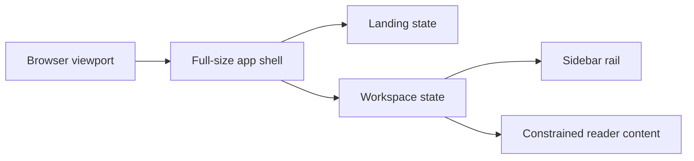

# Full Viewport App Shell

## Summary

<!-- Format: State the outcome, scope, and measurable reason for doing this. -->

Make the Local Spec Viewer use the full browser viewport in its landing and reader states. Remove the centered, max-width paper-card frame and its 24px surrounding gutters while preserving the viewer's paper interior, internal navigation, and readable document column.

## Problem

<!-- Format: Describe the current behavior, observed failure/opportunity, affected users, and evidence. -->

The current desktop shell is a 1200px maximum-width paper card placed inside 24px parchment gutters. This makes the viewer look inset instead of like an application, wastes available space on wide screens, and differs from the existing mobile full-viewport behavior.

## Goals and Non-Goals

<!-- Format: Use two labeled lists: Goals and Non-goals. Keep each item testable or explicitly bounded. -->

### Goals
- Use the complete viewport for the landing and workspace application states.
- Remove the desktop outer-card max width, margin, rounding, and border treatment.
- Keep parchment as a subtle page-level surface rather than large space around the app.
- Preserve the sidebar/reader grid, internal divider, reader measure, and responsive behavior.

### Non-goals
- Redesign typography, controls, navigation content, Markdown rendering, or folder selection.
- Change the existing color tokens or introduce shadows, gradients, or new visual themes.
- Make the reader text column full-width.

## Users and Scenarios

<!-- Format: List actors and numbered scenarios. Include the expected result for each scenario. -->

### Actors
- Developer: opens the local MSDD spec viewer in a desktop or mobile browser.

### Scenarios
1. A developer opens the landing state on a desktop viewport; the application occupies the viewport with no 24px parchment gutter.
2. A developer selects a folder and enters the workspace; the sidebar and reader fill the viewport edge to edge while the reader content stays readable.
3. A developer narrows the browser to the mobile breakpoint; the existing single-column shell remains full viewport without a visual state regression.

## Requirements

<!-- Format: Use stable IDs such as REQ-001. For each requirement state the behavior, inputs/outputs, and priority. -->

- REQ-001: The outer application container must fill the viewport in both landing and workspace states at every supported viewport width. Priority: high.
- REQ-002: The desktop workspace must not use a 1200px max-width, auto horizontal margins, outer border, or rounded-card styling. Priority: high.
- REQ-003: The page must not add 24px outer application padding or compute shell height by subtracting those gutters. Priority: high.
- REQ-004: The workspace must retain its paper interior, sidebar/reader grid, sidebar divider, and constrained reader content width. Priority: high.
- REQ-005: Parchment may remain as the body/page fallback surface but must not appear as large gutters around an active application shell. Priority: medium.
- REQ-006: Existing responsive behavior must keep the application full viewport and preserve usable navigation and reader spacing. Priority: high.

## User/System Flows

<!-- Format: Use numbered steps. Name the actor, system action, state change, and failure branch at each relevant step. -->

1. Browser loads the static viewer; the CSS sizes .app and the visible landing state to the viewport without external padding.
2. Developer selects a folder; the client changes from landing to workspace without changing the viewport shell dimensions.
3. Browser renders the workspace grid across the viewport; the sidebar keeps its fixed rail and the reader retains its internal content measure.
4. When the viewport reaches the existing responsive breakpoint, the grid becomes a single column while retaining full viewport coverage.

## Technical Design

<!-- Format: Describe components, interfaces, data, dependencies, compatibility, security, and operational concerns. -->

### Solution Description
Update only `src/viewer/styles.css` so the application shell uses the viewport directly. Remove desktop-only outer-card rules from `.app` and `.workspace`, set the workspace to full width and at least full viewport height, and size the landing state to the viewport. Preserve the interior paper surfaces and the existing responsive layout.

### Current State
`.app` adds 24px padding. `.landing` and `.workspace` subtract 48px from viewport height. `.workspace` uses `width:min(1200px,100%)`, auto margins, an outer border, and 8px rounding. The mobile breakpoint already resets these card traits.

### Proposed Design
Use the existing mobile full-viewport geometry as the desktop baseline. Set `.app` to at least 100vh with no outer padding. Set `.landing` and `.workspace` to at least 100vh. Set `.workspace` to 100% width and remove its outer margin, border, and corner radius. Keep `body` parchment as a fallback only; retain paper in the shell, sidebar, and reader.

### Architecture / Components
- `src/viewer/styles.css`: owns the viewport shell, workspace grid, and responsive override.
- `src/viewer/index.html` and `src/viewer/app.js`: no behavior or markup changes required.

### Data Model / API Changes
None.

### Technical Decisions
- Apply the same full-viewport behavior to landing and workspace states so state transitions do not change the perceived page frame.
- Preserve the reader's 74ch measure and existing rail width so only the outer shell changes.
- Remove rather than override desktop card styling to avoid conflicting breakpoint rules.

### Trade-offs
- The app loses the decorative desktop card boundary, but gains usable width and a consistent application identity.
- Parchment remains available as a subtle fallback surface but is less prominent in active states.

### Failure Handling
CSS-only changes have no runtime failure path. Test at desktop and mobile widths to detect overflow, accidental gutters, or a lost sidebar divider.

### Testing Strategy
Run the existing test suite. Add or update a targeted stylesheet/UI assertion if the project test setup supports it; otherwise perform documented browser checks at a wide desktop width and at the 700px responsive breakpoint.

## Decisions and Constraints

<!-- Format: Separate Confirmed decisions, Assumptions, Constraints, and Open questions. Do not hide unresolved choices. -->

### Confirmed Decisions
- The application fills the full viewport.
- The centered outer paper card is removed.
- Parchment is only a subtle page surface and not large surrounding gutters.
- The existing interior sidebar and reader structure remains.

### Assumptions
- The target is the Local Spec Viewer in `src/viewer/styles.css`.
- No HTML or JavaScript change is necessary for this visual-only behavior.

### Constraints
- Continue to follow `DESIGN.md`, including flat surfaces and no shadows.
- Preserve the existing responsive breakpoint and readable document column.

### Open Questions
- None.

## Edge Cases and Failure Handling

<!-- Format: Use a case/action table or bullets with trigger, expected behavior, recovery, and user-visible error. -->

- **Wide viewport:** The workspace must remain edge-to-edge and must not reintroduce a maximum width.
- **Mobile viewport:** The existing single-column layout must remain edge-to-edge without duplicate min-height or padding effects.
- **Long reader content:** The page must scroll normally while the shell remains full width.
- **Landing-to-workspace transition:** No parchment gutter or card frame may appear after state changes.

## Acceptance Criteria

<!-- Format: Use stable IDs such as AC-001. Make each criterion observable and state how it will be verified. -->

- AC-001: At a desktop viewport, the visible landing and workspace surfaces reach the viewport edges with no 24px surrounding gutter.
- AC-002: The desktop workspace has no 1200px maximum width, centered auto margin, outer border, or rounded paper-card corners.
- AC-003: The workspace retains the 260px sidebar rail, its internal divider, paper surfaces, and the reader's constrained content measure.
- AC-004: At 700px and below, the single-column layout remains full viewport and does not regress navigation or reader padding.
- AC-005: Automated tests pass and manual browser checks confirm the wide and narrow viewport results.

## Explanation and Output Artifacts

<!-- Format: Use labeled fields: Audience, Writing profile, Primary artifact, Supporting artifacts, and Accessibility. Prefer an 80% ASD-STE100 controlled-language style for explanatory prose unless strict ASD-STE100 or plain language is required. Choose the clearest medium: prose, diagram, interactive HTML, or narrated explainer video. State the topic, purpose, interaction or narration needs, delivery location, and acceptance evidence for each requested artifact. -->

- Audience: Developers reading local MSDD specifications.
- Writing profile: 80% ASD-STE100 controlled-language technical prose.
- Primary artifact: Updated full-viewport viewer shell in `src/viewer/styles.css`; its purpose is to provide an edge-to-edge application surface in both viewer states.
- Supporting artifacts: This specification, generated task list, focused test or manual viewport verification evidence.
- Accessibility: Preserve semantic structure, readable reader line length, keyboard behavior, visible focus styles, and responsive single-column navigation.

## Implementation Plan

<!-- Format: Use ordered, independently verifiable tasks. Include dependencies and the files or boundaries affected. -->

1. Update `src/viewer/styles.css` to remove outer app padding and make the landing and workspace states at least viewport height.
2. Replace the desktop workspace card geometry with a full-width, edge-to-edge shell while preserving internal paper surfaces, grid tracks, and reader measure.
3. Simplify the responsive rule so it only changes the grid and internal spacing required for narrow screens, without restoring outer-card properties.
4. Run automated tests and inspect the landing and workspace at wide and narrow viewport sizes; record the result in this specification.

## Verification and Implementation Notes

<!-- Format: List commands/tests, expected evidence, rollout checks, and a place to record deviations. -->

- Run `npm test`; expected result: all existing tests pass.
- Start `msdd serve` and inspect a desktop viewport; expected result: landing and workspace fill the viewport with no outer parchment gutter.
- Resize to 700px or below; expected result: the single-column layout stays full viewport and retains usable reader padding.
- Record any visual deviation, test result, and manual verification evidence after implementation.
- Evidence: T1 removed the 24px application padding and replaced the landing and workspace `calc(100vh - 48px)` minimum heights with `100vh`; `git diff --check -- src/viewer/styles.css` passed on 2026-10-10.
- Evidence: T2 set `.workspace` to `width:100%` and removed its max-width, auto margin, outer border, and rounding while retaining the 260px grid rail, paper interior, and overflow handling; a Node CSS assertion and `git diff --check -- src/viewer/styles.css` passed on 2026-10-10.
- Evidence: T3 reduced the 700px media rule to the narrow-screen grid and interior sidebar/reader spacing changes; a Node CSS assertion confirmed it contains no outer-card restoration and `git diff --check -- src/viewer/styles.css` passed on 2026-10-10.
- Evidence: T4 `npm test` passed 22 of 22 tests on 2026-10-10. A Chrome inspection of the local viewer at a wide desktop viewport confirmed the landing surface reaches every viewport edge with no outer card or parchment gutter. CSS inspection confirmed the workspace remains `width:100%` and `min-height:100vh`, while the 700px rule changes only the grid and internal spacing.
- Evidence: T5 reused the successful T4 `npm test` run: all 22 tests passed with no failures on 2026-10-10.
- Evidence: T6 served the viewer on `http://127.0.0.1:5635/` and inspected it in Chrome at a wide desktop viewport on 2026-10-10. The landing fills the viewport edge-to-edge; the corresponding workspace rule is `width:100%` and `min-height:100vh` with no outer card geometry.
- Evidence: T7 used a focused Node CSS assertion on 2026-10-10 to verify that the base workspace remains `width:100%` and `min-height:100vh` below the breakpoint, and that the 700px rule changes to one grid column while retaining `#reader`'s 24px padding.
- Evidence: T8 recorded no visual deviations from the approved scope. The final diff changes only the viewport-shell CSS and the generated feature artifacts; `git diff --check` passed on 2026-10-10.
