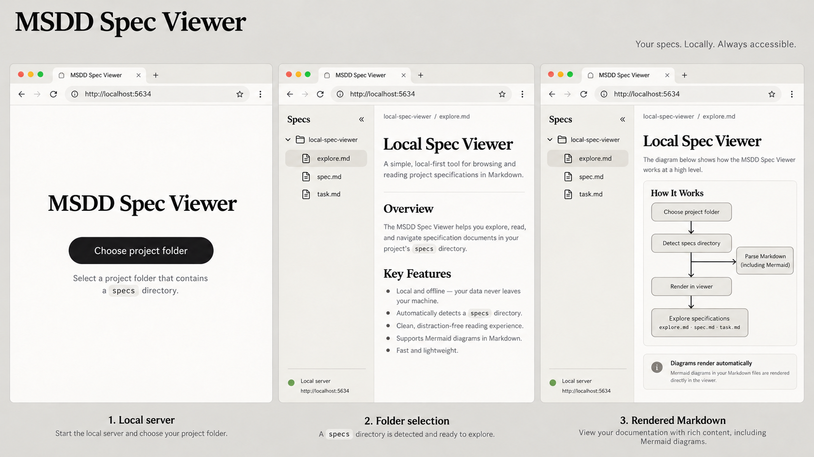

# Exploration: Local Spec Viewer

## Context

Add `msdd serve`, which launches a localhost-only server on port 5634 and presents a minimal browser-based viewer for MSDD specifications. The first page provides a folder-selection action. After the user grants local folder access, it detects a `specs/` directory directly inside that selected folder; when present it displays all specifications as a clickable tree sidebar and renders the selected Markdown document cleanly in the reading pane, including Mermaid diagrams. No login, account, hosted service, or project mutation is required.

## Codebase Analysis

The existing CLI is a dependency-free ESM Node program: `bin/msdd.js` calls `src/cli.js`, whose `main(args, cwd)` dispatches commands; `src/core.js` owns feature-directory naming and Markdown-spec artifacts; tests use Node's built-in test runner in `test/core.test.js`. The package currently ships `bin/`, `src/`, documentation, and skills and supports Node >=18. `serve` is not registered today; help text and unknown-command guidance enumerate the supported commands. The repository already uses `specs/<slug>/explore.md`, `spec.md`, and `task.md`; a viewer must tolerate partially-created feature folders and Markdown without every artifact.

Browser pages cannot safely disclose an arbitrary local directory path to a Node server, while Chromium-derived browsers can grant a directory handle through the File System Access API. Native OS directory dialogs are not available from Node without adding a platform-specific dependency.

## Recommendations

- Implement a small localhost HTTP server owned by the CLI, bound explicitly to loopback and using port 5634 as the default.
- Serve a self-contained minimal single-page UI.
- Treat the repository's `DESIGN.md` as the UI source of truth. The implementation specification must reference and apply its typography, color, spacing, button, and surface guidance rather than inventing a separate visual system.
- Prefer the browser File System Access API (`showDirectoryPicker`) from an explicit user gesture; traverse only the granted folder to locate its direct `specs/` child and enumerate Markdown artifacts.
- Provide a directory-input fallback where possible, with a clear unsupported-browser message otherwise.
- Build the sidebar from directory and Markdown file names, with feature folders as tree nodes and their Markdown artifacts as leaves; choose `spec.md` as the initial document when available.
- Render Markdown client-side with sanitization and render fenced `mermaid` blocks after insertion.
- For genuinely local/offline behavior, package the rendering assets or a local Mermaid runtime rather than relying on a CDN; this creates a runtime-dependency/bundling decision.
- Keep server endpoints static because the browser holds file permissions and document contents, not the server.
- Add focused CLI/server/UI tests, including command registration, loopback/port behavior, absent `specs/` messaging, nested tree ordering, Markdown rendering, and Mermaid invocation.

Adding a small front-end dependency improves robust Markdown/Mermaid behavior but increases package and asset-serving complexity. Hand-written Markdown parsing retains a dependency-free package but would be incomplete and unsafe.

## Visual Mockup

The reference presents the three key screens: initial folder selection, a detected `specs/` tree with rendered Markdown, and the same reading view with an automatically rendered Mermaid diagram. The landing view is deliberately limited to the folder-selection action and its necessary instruction; it must not repeat obvious local/privacy/performance claims. The reader does not include a settings control because no settings behavior is in scope. It applies `DESIGN.md`: the warm parchment/paper/sand surfaces, editorial serif headings with spaced sans-serif body text, dark pill CTA, hairline borders, and flat monochrome treatment. It depicts the preferred port, `localhost:5634`; the implementation must still display the selected fallback port when 5634 is unavailable.

## Open Questions

- Is Chromium-family browser support acceptable as the primary experience, with a directory-upload fallback that cannot preserve live folder handles?
- Should the command automatically open the default browser, or only print `http://127.0.0.1:5634`?
- Does `specs/` mean only the immediate child of the selected root (recommended), and should the tree display every `.md` file under it or only named MSDD artifacts?
- Should selection persist only for the current page session (recommended), or be remembered locally?
- What level of Markdown extensions besides Mermaid is required (tables, task lists, syntax-highlighted code, links)?

## Decisions Confirmed

- The command is named `msdd serve`.
- It starts a local server on port 5634.
- If port 5634 is occupied, it automatically chooses the next available port.
- It requires no login.
- The first page lets the user select a folder.
- A direct `specs/` folder is the eligibility signal.
- A detected folder presents the specs in a sidebar tree.
- Selecting an item displays clean rendered Markdown in the adjacent reading area.
- Mermaid diagrams must render for reading.
- The UI must follow the repository's `DESIGN.md`.
