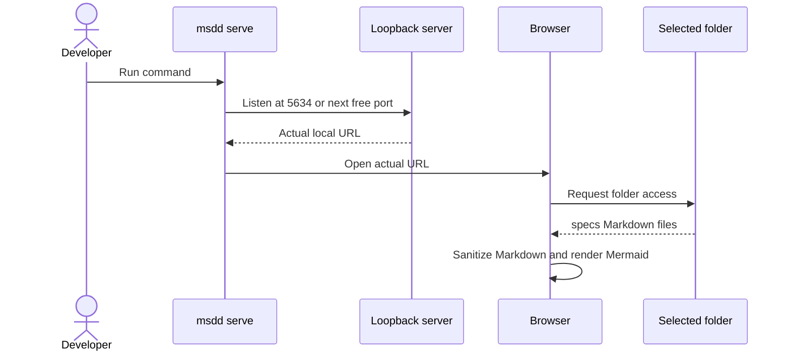

# Local Spec Viewer

## Summary

<!-- Format: State the outcome, scope, and measurable reason for doing this. -->

Implement `msdd serve`, a local-only specification viewer. It starts a loopback HTTP server at port 5634 or the next available port, opens the actual URL in the user's default browser, and lets the user select a project directory to browse Markdown files under its direct `specs/` child. The viewer renders Markdown and Mermaid without login or remote content.

## Problem

<!-- Format: Describe the current behavior, observed failure/opportunity, affected users, and evidence. -->

MSDD specifications are stored as Markdown files, so readers must manually find files and use an editor or another viewer. The CLI has no `serve` command or browser UI. A local reader should make generated feature artifacts easier to inspect without creating an account, changing the selected project, or sending its contents to a service.

## Goals and Non-Goals

<!-- Format: Use `### Goals` and `### Non-goals` headings, each followed by a Markdown bullet list. Keep each item testable or explicitly bounded. -->

### Goals

- Add `msdd serve` to start a loopback-only viewer, beginning at port 5634 and selecting the next available port automatically.
- Auto-open the actual viewer URL in the default browser after the listener is ready, and print that URL to the terminal.
- Let a user select a project directory and detect only a direct `specs/` child directory.
- Show every `.md` file below the detected `specs/` directory in an ordered, expandable sidebar tree.
- Render a selected Markdown document safely, including GFM-style tables, task lists, fenced code, and Mermaid diagrams.
- Apply the repository `DESIGN.md` visual system and use the attached mockup as the screen-level reference.

### Non-goals

- Authenticate users, host a service, upload project files, or retain project content on a server.
- Edit, create, rename, delete, or persist selected project files.
- Add settings, a browser-visible configuration UI, search, collaboration, or a multi-project library.
- Support arbitrary local filesystem paths supplied through HTTP requests.
- Build a general-purpose IDE or Markdown authoring application.

## Users and Scenarios

<!-- Format: Use `### Actors` followed by a Markdown bullet list, then `### Scenarios` followed by a Markdown numbered list. Include the expected result for each scenario. -->

### Actors

- Developer: runs `msdd serve` from a terminal and reads an MSDD project specification.
- Browser: receives a static local page and grants directory access only after the developer selects a folder.

### Scenarios

1. A developer runs `msdd serve` while port 5634 is free; the command binds `127.0.0.1:5634`, opens the default browser, prints the URL, and presents folder selection.
2. A developer runs `msdd serve` while port 5634 is occupied; the command binds the first subsequent free port, opens that actual URL, and prints it.
3. A developer selects a project root containing a direct `specs/` directory; the viewer displays a sorted tree and initially opens that feature's `spec.md` when one exists.
4. A developer selects a folder without a direct `specs/` directory; the viewer explains the requirement and keeps the folder-selection action available.
5. A developer selects a Markdown file with a fenced `mermaid` block; the viewer renders the diagram in the document pane.
6. A developer uses a browser without the File System Access API; the viewer offers directory upload when supported or explains that a compatible browser is required.

## Requirements

<!-- Format: Use stable IDs such as REQ-001. For each requirement state the behavior, inputs/outputs, and priority. -->

- REQ-001: `msdd serve` must be registered in CLI help and dispatch without requiring a feature name.
- REQ-002: The server must bind only to `127.0.0.1`, first attempt port 5634, then try increasing port numbers until it finds an available port or reaches a documented bounded failure.
- REQ-003: After listening, the command must print the actual `http://127.0.0.1:<port>` URL and invoke the platform default-browser opener for that URL.
- REQ-004: The server must serve only the viewer's static UI and locally packaged client assets; it must not provide filesystem-reading API endpoints.
- REQ-005: The landing screen must contain the viewer identity, a folder-selection action, the necessary direct-`specs/` instruction, and a compact history of previously selected compatible folders.
- REQ-006: The primary folder action must use `showDirectoryPicker()` after an explicit user gesture when available. The fallback must use a directory file input where the browser supports it.
- REQ-007: The client must inspect only the granted/selected directory, require its direct child named `specs`, recursively enumerate `.md` files below it, and retain document data only in page memory.
- REQ-014: When a compatible directory is successfully selected through the File System Access API, the client must store its directory handle and display name in local IndexedDB history. Selecting a history card must re-request read permission before use, retain no document contents, deduplicate by name/handle, and retain at most six most recently used folders. Directory-upload fallback selections must not appear in history.
- REQ-008: The sidebar must preserve directory nesting, sort directories and files predictably, use expandable directory nodes, and select `spec.md` first when present; otherwise it must select the first sorted Markdown file.
- REQ-009: The reader must convert supported Markdown to HTML, sanitize the result before insertion, and render fenced `mermaid` blocks with a locally served Mermaid runtime using strict diagram security.
- REQ-010: Unsupported or malformed Markdown, unreadable files, Mermaid render failures, cancelled selection, absent `specs/`, unavailable browser APIs, failed browser opening, and port exhaustion must produce actionable messages without exposing project content.
- REQ-011: The UI must implement `DESIGN.md`: parchment `#dbdad7` canvas, paper and sand surfaces, ink/smoke/charcoal palette, editorial serif display headings, tracked sans-serif interface text, dark pill primary CTA, hairline borders, and no decorative gradients or shadows. Moss green is reserved for status/data only.
- REQ-012: The UI must not show a settings control or redundant local/privacy/performance marketing claims.
- REQ-013: The package must include all viewer source and locally required rendering assets in the published artifact.

## User/System Flows

<!-- Format: Use numbered steps. Name the actor, system action, state change, and failure branch at each relevant step. -->

1. Developer runs `msdd serve`; CLI creates the viewer server and asks it to listen on `127.0.0.1:5634`.
2. If the port is busy, the server increments the candidate port and retries; if its bounded range is exhausted, CLI reports the port error and exits nonzero.
3. After the server listens, CLI prints the resolved URL and runs the platform browser opener; an opener failure is reported but does not stop the server.
4. Browser loads static HTML, CSS, JavaScript, and packaged dependencies from the loopback server; no project data is requested from the server.
5. Developer chooses a project folder or a previous-folder card; client receives a new directory handle, directory-upload file list, or re-requests permission for the stored local handle.
6. Client looks for direct child `specs`; if absent, it shows a recovery message and returns control to folder selection.
7. Client recursively constructs the sorted `.md` tree, selects `spec.md` when present, reads its content locally, sanitizes rendered Markdown, then renders Mermaid blocks.
8. Developer clicks another tree leaf; client reads and renders only that local Markdown file.
9. If rendering fails, client retains navigation and displays an error in the reading pane with a retry/select-another-file path.

## Technical Design

<!-- Format: Describe components, interfaces, data, dependencies, compatibility, security, and operational concerns. -->

### Solution Description

Add a `serve` branch to the existing ESM CLI. A new server module owns loopback listening, port fallback, static asset responses, and browser opening. A static single-page client performs all selected-directory inspection and document reading, so no local paths or file contents cross an HTTP API boundary. Client-side packages provide Markdown parsing, HTML sanitization, and Mermaid rendering; the server exposes their browser-ready assets from installed package paths.

### Current State

`src/cli.js` dispatches `init`, `explore`, `spec`, `review`, and `build`; it has no HTTP server or UI. T1 added local runtime dependencies for `marked`, DOMPurify, and Mermaid, and the package check now requires the planned server/viewer source paths and verifies their installed browser assets after package installation.

### Proposed Design

Create `src/server.js` with exported functions for server creation, bounded sequential port selection, MIME-safe static asset serving, and platform browser opening. Create a static viewer under `src/viewer/` with `index.html`, `styles.css`, and `app.js`. The page uses the File System Access API as the primary source, then a `webkitdirectory` input fallback. It builds an in-memory tree of Markdown file descriptors rather than sending filesystem paths to Node. Markdown is parsed by `marked`, sanitized by DOMPurify, and Mermaid fences are converted to render targets and rendered by locally served `mermaid`.

### Architecture / Components

- `src/cli.js`: recognizes `serve`, prints URL, and keeps the process active until termination.
- `src/server.js`: binds `127.0.0.1`, finds a free port by incrementing from 5634 within a documented 100-port range, serves static files and package assets, and invokes `open`/`xdg-open`/Windows `start` without a shell.
- `src/viewer/index.html`: minimal semantic application shell.
- `src/viewer/styles.css`: applies `DESIGN.md` tokens and responsive sidebar/reader layout.
- `src/viewer/app.js`: selection adapters, IndexedDB recent-folder history, safe tree creation, selected-file loading, Markdown rendering, Mermaid rendering, and user-visible errors.
- Runtime dependencies: `marked`, `dompurify`, and `mermaid`, all resolved and served locally from installed package assets.

### Data Model / API Changes

No persistent data model and no project-file API exists. The server adds static routes only: `/` for the app, viewer assets, and narrowly allowlisted locally installed renderer assets. Client memory contains `{ name, relativePath, readText }` descriptors and tree nodes. Directory handles and file lists are never serialized or stored.

### Technical Decisions

- Bind loopback only to prevent LAN access.
- Prefer browser-granted directory handles because the browser, not Node, enforces the selected-directory scope.
- Recognize only a direct `specs/` child to avoid surprising traversal.
- Enumerate every nested `.md` document so `explore.md`, `spec.md`, `task.md`, and supporting documentation remain visible.
- Use locally packaged rendering libraries, not a CDN, so viewer rendering has no remote dependency.
- Keep document content in-memory only; persist only File System Access directory handles and display names in IndexedDB for up to six recent folders.

### Trade-offs

- Runtime dependencies and static asset routing add package complexity, but replace unsafe/incomplete handwritten Markdown and diagram parsing.
- The File System Access API provides the best folder experience but is not universal; directory upload has weaker live-directory behavior.
- A 100-port fallback range makes startup deterministic and testable while providing clear failure after sustained contention.
- Recent-folder cards are unavailable after the directory-upload fallback because browsers do not allow its File objects to be persisted and reopened safely.

### Failure Handling

A busy port retries the next candidate. Exhaustion reports the attempted range. Browser-open failure logs the URL for manual navigation and keeps the server running. The client handles cancellation without error, displays a direct-`specs/` recovery message, reports unsupported selection APIs, skips a diagram that fails to render while preserving the Markdown document, and escapes/sanitizes unsafe markup.

### Testing Strategy

Use Node tests for CLI registration, loopback binding, sequential port fallback, bounded exhaustion, static-route allowlisting, and browser opener invocation through dependency injection. Test client helpers with DOM-capable tests or isolated pure functions for direct-`specs/` detection, recursive sorted trees, default document choice, Markdown sanitization, Mermaid target extraction, and error states. Add package checks that verify viewer files and needed runtime assets are included.

## Decisions and Constraints

<!-- Format: Use `### Confirmed Decisions`, `### Assumptions`, `### Constraints`, and `### Open Questions` headings, each followed by Markdown bullets. Do not hide unresolved choices. -->

### Confirmed Decisions

- The command is `msdd serve`.
- The default port is 5634, then the next available port is selected automatically.
- The viewer uses no login and runs locally.
- The default browser opens automatically after startup.
- A direct `specs/` child enables viewing.
- The UI shows a sidebar tree, clean Markdown reader, and Mermaid diagrams.
- `DESIGN.md` governs UI design.
- The landing view has no settings control or redundant benefit claims.

### Assumptions

- Chromium-family browsers support the primary directory-picker path.
- Every nested `.md` file beneath `specs/` is useful to readers.
- GFM-like tables, task lists, links, and fenced code are sufficient Markdown support beyond Mermaid.

### Constraints

- Node runtime is >=18 and the existing CLI is ESM.
- The listener must be loopback-only.
- Project contents must remain in the browser after explicit user selection.
- Package assets must render without CDN/network access.

### Open Questions

- None; unsupported browsers receive the defined directory-upload fallback or compatibility message.

## Edge Cases and Failure Handling

<!-- Format: Use a case/action table or bullets with trigger, expected behavior, recovery, and user-visible error. -->

- **Port 5634 busy:** Try subsequent ports in the configured range and use the first free one; print and open the resolved URL.
- **Port range exhausted:** Do not bind an external address; exit nonzero and name the attempted range.
- **Browser opener fails:** Keep the server listening; print a warning and the URL for manual navigation.
- **User cancels selection:** Do not inspect files; retain the folder-selection action without a destructive error.
- **No direct `specs/` child:** Do not traverse elsewhere; show the direct-`specs/` requirement and let the user select another folder.
- **No Markdown files:** Show an empty tree state; let the user select another folder or add files outside the viewer.
- **Unsupported browser API:** Use the directory-upload fallback where available; otherwise show a compatibility message.
- **File cannot be read:** Keep the tree usable and show a file-specific reader error with recovery by reselection.
- **Unsafe HTML or Mermaid error:** Sanitize HTML and isolate the failed Mermaid block while preserving the remaining document content.

## Acceptance Criteria

<!-- Format: Use stable IDs such as AC-001. Make each criterion observable and state how it will be verified. -->

- AC-001: `msdd serve` is documented by CLI help and starts a loopback server without a feature argument.
- AC-002: When 5634 is available, the command prints and opens `http://127.0.0.1:5634`; when it is occupied, it prints and opens the first subsequent available port.
- AC-003: Requests from non-loopback interfaces are not accepted by the server configuration.
- AC-004: The initial screen shows the product identity, folder action, direct-`specs/` instruction, and no more than six previous-folder cards. It contains no settings icon or redundant benefit cards.
- AC-011: A successful File System Access selection appears as a reusable history card after reload; selecting it requests permission and opens the tree only after access is granted.
- AC-005: Selecting a root with direct `specs/` displays a predictable expandable tree of all nested `.md` files and opens `spec.md` first when available.
- AC-006: Selecting a root without direct `specs/` displays a clear recovery message and no files outside that root are read.
- AC-007: A document with headings, tables, task lists, code fences, links, and Mermaid blocks renders safely and legibly; Mermaid becomes a diagram.
- AC-008: The rendered UI follows the `DESIGN.md` palette, typography, pill controls, flat surfaces, and no-shadow constraint.
- AC-009: Package inspection confirms viewer source and locally required renderer assets are shipped.
- AC-010: Focused automated tests pass for command dispatch, ports, static serving, selection/tree behavior, renderer safety, and key error states.

## Explanation and Output Artifacts

<!-- Format: Use a Markdown bullet list with separate `Audience:`, `Writing profile:`, `Primary artifact:`, `Supporting artifacts:`, and `Accessibility:` fields. Prefer an 80% ASD-STE100 controlled-language style for explanatory prose unless strict ASD-STE100 or plain language is required. Choose the clearest medium: prose, diagram, interactive HTML, or narrated explainer video. State the topic, purpose, interaction or narration needs, delivery location, and acceptance evidence for each requested artifact. -->

- Audience: Developers who run MSDD and need to read local specifications.
- Writing profile: 80% ASD-STE100 controlled-language technical prose with concise actionable UI messages.
- Primary artifact: A local browser viewer, with the attached `spec-viewer-mockup.png` as the visual-reference artifact.
- Supporting artifacts: CLI usage/help text, the `DESIGN.md`-aligned static UI, automated tests, and a package-content check.
- Accessibility: Use semantic controls, visible keyboard focus, readable contrast, responsive layout, descriptive error text, and Mermaid fallbacks that do not hide surrounding document content.

## Implementation Plan

<!-- Format: Use ordered, independently verifiable tasks. Include dependencies and the files or boundaries affected. -->

1. Add runtime dependencies and package-content configuration for local Markdown, sanitization, and Mermaid assets; update package checks to include the new viewer artifacts.
2. Implement and test the loopback static server, bounded sequential port fallback, safe asset allowlist, and injectable default-browser opener in `src/server.js`.
3. Register and test `msdd serve` in `src/cli.js`, including help text, startup URL output, graceful opener warning, and process lifecycle.
4. Build the static viewer shell and `DESIGN.md`-aligned styles for the minimal landing, sidebar tree, and reading pane.
5. Implement and test browser directory selection adapters, direct-`specs/` validation, recursive Markdown tree creation, deterministic default selection, and page-session-only state.
6. Implement and test sanitized Markdown rendering and locally served Mermaid rendering, including recoverable file, parser, and diagram failures.
7. Implement and test IndexedDB-backed recent-folder cards, permission revalidation, deduplication, six-item retention, and the non-persistent directory-upload fallback.
8. Run the full test suite and package check; manually verify selection, fallback port, default-browser URL, responsive reader, mockup-aligned UI, and recent-folder reuse, then record evidence.

## Verification and Implementation Notes

<!-- Format: List commands/tests, expected evidence, rollout checks, and a place to record deviations. -->

- Evidence: T1 — `npm install marked dompurify mermaid` added the local renderer dependencies; `npm test` passed 13 tests on 2026-10-10.
- Evidence: T2 — added `src/server.js` with loopback-only bounded sequential port selection, allowlisted static routes, and a shell-free injectable browser opener; `npm test` passed 17 tests on 2026-10-10.
- Evidence: T3 — registered `msdd serve`, URL output, default-browser opening, and an injectable opener/startup path; `npm test` passed 18 tests on 2026-10-10.
- Evidence: T4 — added the static semantic viewer shell and `DESIGN.md`-aligned responsive styles; the landing has only the required folder action/instruction and no settings control; `npm test` passed 18 tests on 2026-10-10.
- Evidence: T5 — added browser directory adapters, direct-`specs/` validation, nested sorted Markdown tree construction, default `spec.md` selection, and page-memory-only state; `npm test` passed 20 tests on 2026-10-10.
- Evidence: T6 — Markdown now renders through locally served `marked` and DOMPurify. Mermaid is loaded lazily only when a Mermaid block is selected, then uses strict local rendering with an inline failure fallback. This prevents a Mermaid module-load failure from disabling folder selection. `npm test` passed 20 tests on 2026-10-10.
- Evidence: T8 — added IndexedDB storage of up to six File System Access folder handles, permission revalidation before reuse, deduplicated recent-folder cards, and no history for directory-upload fallback; `npm test` passed 22 tests on 2026-10-10.
- Evidence: T7 (partial) — `npm test` passed 21 tests and `npm run package:check` validated the packed artifact, including viewer source and installed renderer assets, on 2026-10-10. Manual browser interaction exposed a CSS state-visibility defect: `.workspace` overrode its `hidden` attribute and rendered below the landing view. The fix adds a global `[hidden] { display: none !important; }` rule, so landing and reader are mutually exclusive states. It also exposed visual drift from `spec-viewer-mockup.png`; the reader now uses a compact 260px navigation rail, a constrained 74ch reading column, 36px document heading, and the specified editorial type hierarchy. Manual browser interaction remains required for the host browser's directory-permission dialog.
- Evidence: Pending — reserve port 5634, run `msdd serve`, and verify the printed/opened URL uses the next free port.
- Evidence: Pending — use a fixture project with nested `specs/` Markdown and Mermaid; verify tree order, default `spec.md`, sanitized rendered HTML, and Mermaid output.
- Evidence: Pending — use a root without direct `specs/`; verify recovery copy and no traversal outside the selected root.
- Evidence: Pending — inspect the landing and reader against `DESIGN.md` and `spec-viewer-mockup.png`; verify no settings icon or redundant landing benefit copy.
