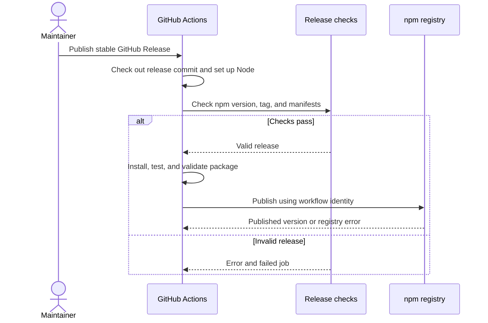

# Publish to npm using GitHub Actions

## Summary

<!-- Format: State the outcome, scope, and measurable reason for doing this. -->

Repair the existing GitHub Actions release workflow so a maintainer can publish the public `msdd-it` package with npm trusted publishing. Use a compatible Node/npm toolchain, check release identity and versions, retain package validation, and document account setup. The measurable outcome is a locally verified workflow contract and a complete maintainer runbook; a live release is a separate operational action.

## Problem

<!-- Format: Describe the current behavior, observed failure/opportunity, affected users, and evidence. -->

The current `.github/workflows/publish.yml` pins Node 22.14.0, which includes npm 10.9.2. npm trusted publishing needs npm >=11.5.1 and Node >=22.14.0. The job requests OIDC permission but cannot rely on its bundled npm for OIDC publishing. It also lacks tag/version validation and a prerelease policy. README supplies a workflow path where npm requires a filename. These gaps can block publishing or send unintended versions to latest. Exploration found local version 0.4.12 and registry latest 0.3.9; this does not identify the next unused release version.

## Goals and Non-Goals

<!-- Format: Use `### Goals` and `### Non-goals` headings, each followed by a Markdown bullet list. Keep each item testable or explicitly bounded. -->

### Goals
- Make the existing release job compatible with npm OIDC publishing without an npm write token.
- Publish only validated stable releases whose tag matches both package manifests.
- Give maintainers exact setup, release, verification, and recovery instructions.
### Non-goals
- Publish a package, create a GitHub Release/tag, or change npm/GitHub account settings during implementation.
- Add automatic version bumps, changelog generation, semantic-release, Changesets, or prerelease channels.
- Change the package name, runtime Node support declaration, dependencies, CLI behavior, or package contents.

## Users and Scenarios

<!-- Format: Use `### Actors` followed by a Markdown bullet list, then `### Scenarios` followed by a Markdown numbered list. Include the expected result for each scenario. -->

### Actors
- Maintainer: configures the npm trust relationship and publishes a GitHub Release.
- GitHub Actions runner: validates the tagged source and invokes npm publish.
- npm registry: authenticates the job and accepts an unused package version.
### Scenarios
1. A maintainer publishes stable release vX.Y.Z with matching manifests; checks pass and npm receives msdd-it@X.Y.Z on latest.
2. A tag differs from the package version or lockfile; the workflow fails before publishing with a useful error.
3. A GitHub prerelease is published; the publishing job is skipped.
4. A trust configuration is missing or incorrect; npm rejects publishing and the runbook explains recovery without adding a write-token fallback.

## Requirements

<!-- Format: Use stable IDs such as REQ-001. For each requirement state the behavior, inputs/outputs, and priority. -->

- REQ-001 (Must): Keep the release published event, GitHub-hosted ubuntu-latest runner, npm environment, and contents: read / id-token: write permissions; restrict the job to repository muthuspark/msdd and non-draft, non-prerelease releases.
- REQ-002 (Must): Use actions/checkout@v6 and actions/setup-node@v6 with Node 24 and registry https://registry.npmjs.org; disable checkout credential persistence and setup-node caching by omitting cache and setting package-manager-cache: false.
- REQ-003 (Must): Log Node/npm versions and fail before npm ci if npm is below 11.5.1; use bundled npm without a global latest upgrade.
- REQ-004 (Must): Validate package name msdd-it, a stable X.Y.Z package version with no leading-zero numeric identifiers, release tag exactly v plus that version, and identical version/name in package-lock.json and its root package entry; fail before install or publish on mismatch.
- REQ-005 (Must): Pass the release tag through an environment variable or read GITHUB_EVENT_PATH; never interpolate event data into shell source. Check out the release event commit, not the current default branch.
- REQ-006 (Must): Keep npm ci, npm test, and npm run package:check as sequential gates before npm publish --access public --tag latest --provenance. Do not configure NPM_TOKEN or NODE_AUTH_TOKEN for publishing.
- REQ-007 (Must): Add a concurrency group scoped to the release tag with cancel-in-progress: false, preventing simultaneous same-tag publishing without claiming rerun idempotency.
- REQ-008 (Must): Document npm trusted publisher fields, npm environment setup, direct publish permission, compatible versions, matching version/tag preparation, full published-version lookup, release trigger, registry verification, and failure recovery.
- REQ-009 (Must): Add focused automated coverage for release validation success and rejection paths; validation and tests must not call npm publish or require account credentials.

## User/System Flows

<!-- Format: Use numbered steps. Name the actor, system action, state change, and failure branch at each relevant step. -->

1. The maintainer verifies npm package access and configures its trusted publisher for muthuspark/msdd, publish.yml, and environment npm; account setup remains a prerequisite.
2. The maintainer selects an unused stable version, updates matching manifests, commits changes, pushes vX.Y.Z for that commit, then publishes a GitHub Release.
3. GitHub filters unsupported repository/prerelease events and serializes same-tag jobs; skipped jobs never publish.
4. The runner checks out the release commit, sets up Node 24, reports versions, and validates the npm minimum and release manifests; invalid inputs stop the job.
5. The runner installs locked dependencies, runs tests, and validates the packed CLI; any failed command stops publication.
6. npm uses the workflow OIDC identity and publishes msdd-it with public access, latest, and provenance; authentication or registry errors fail the job without a token fallback.
7. The maintainer checks the exact published version and latest tag; if a rerun reports an existing version, verify the previous result before selecting any new version.

## Technical Design

<!-- Format: Describe components, interfaces, data, dependencies, compatibility, security, and operational concerns. -->

### Solution Description
Keep the existing GitHub Release boundary and repair its toolchain and validation. A small Node script checks the release event against package metadata before dependency installation. The existing tests and tarball smoke checks remain the publication gate.

### Current State
Before this change, one publish workflow installed, tested, validated, and published using Node 22.14.0 and v4 actions. The implementation now uses Node 24/v6 actions and release validation. No build step is required because the package ships source.

### Proposed Design
Update `.github/workflows/publish.yml` as specified in REQ-001 through REQ-007. Add `scripts/release-check.js` as an ESM module using Node built-ins. The script exports validateRelease({ event, packageJson, lockfile, npmVersion }) for tests and provides a direct-execution entry point for the workflow. A successful validation returns the package version; invalid data throws a descriptive Error. The entry point reads GITHUB_EVENT_PATH, package.json, and package-lock.json, runs npm --version without a shell, prints Node/npm versions, and exits nonzero with a descriptive message on failure. The script receives no credentials and performs no registry mutations.

Validation checks the release object, stable flag, repository full_name, exact tag/name/version agreement, and minimum npm version. Use explicit numeric comparison for npm versions and reject malformed or prerelease npm version strings. Stable package versions must match canonical X.Y.Z numeric identifiers; no prerelease/build suffix is supported in this scope. Run validation immediately after Node setup, before npm ci. Use the release event SHA through checkout defaults; do not use release.target_commitish as an override because it may name a moving branch.

### Architecture / Components
- `.github/workflows/publish.yml`: event filtering, runner/toolchain setup, concurrency, ordered checks, and OIDC publish.
- `scripts/release-check.js`: release metadata and npm version validation; excluded by the current package files allowlist.
- `test/release-check.test.js`: table-driven tests using node:test and in-memory metadata.
- `README.md`: maintainer publishing runbook and troubleshooting.
- npm/GitHub account settings: external prerequisites documented for maintainers.

### Data Model / API Changes
None. Internal validation consumes GitHub event release.tag_name, release.prerelease, release.draft, repository.full_name, npm version, package name/version, and lockfile top-level/root name/version. No public CLI command is added.

### Technical Decisions
Use Node 24 only for release CI; retain the current consumer engines declaration. Use supported v6 actions and no release dependency cache. Keep explicit provenance and latest flags for clarity. Use a pure validator plus CLI entry point so rejection paths can be tested without a live release. Do not query the registry in the validator: npm remains authoritative for duplicate-version rejection.

### Trade-offs
Maintainers still choose versions and create releases manually. Node 24 patch updates are resolved by setup-node, while a minimum-version guard prevents silently losing OIDC support. Same-tag concurrency prevents overlapping attempts but cannot make an immutable publish repeatable. A stable-only policy postpones prerelease distribution.

### Failure Handling
Return a nonzero exit and name the failed field for invalid metadata or npm version. Standard GitHub step failure prevents later publish. Propagate npm install, test, package validation, authentication, and publish errors. Never retry publishing automatically after an uncertain registry result.

### Testing Strategy
Exercise the validator with valid events, tag/version/name mismatches, malformed stable versions, both lockfile version mismatches, wrong repository, draft/prerelease events, missing release fields, npm below minimum, exact minimum, a newer major, and malformed npm versions. Test the CLI entry point with temporary manifests/event data and an isolated fake npm executable to verify exit status and useful messages without publishing. Validate workflow syntax with actionlint when available and inspect that every publish path follows validation. Run the existing complete tests and package check on Node 24 during implementation.

References checked on 2026-10-10: [npm trusted publishing](https://docs.npmjs.com/trusted-publishers/), [setup-node v6 inputs](https://raw.githubusercontent.com/actions/setup-node/v6/action.yml), [checkout v6 inputs](https://raw.githubusercontent.com/actions/checkout/v6/action.yml), [GitHub release events](https://docs.github.com/en/actions/reference/workflows-and-actions/events-that-trigger-workflows#release).

## Decisions and Constraints

<!-- Format: Use `### Confirmed Decisions`, `### Assumptions`, `### Constraints`, and `### Open Questions` headings, each followed by Markdown bullets. Do not hide unresolved choices. -->

### Confirmed Decisions
- The user requested npm publishing through GitHub Actions and explicitly invoked msdd-spec after exploration.
- The user invoked msdd-build for this specification, authorizing its repository implementation and stable-only direct publishing policy; account changes and live publication remain outside scope.
### Assumptions
- The approved build uses the proposed stable-only direct publishing policy; prerelease distribution and npm staging remain outside scope.
- Retain msdd-it, muthuspark/msdd, publish.yml, and environment npm from the current repository.
- A maintainer can access the npm package and configure its trust relationship before release.
### Constraints
- No production/configuration changes, account writes, version bump, tag, or publication during specification.
- Implementation is limited to workflow, internal validation script/tests, and release documentation.
- OIDC verification requires a real GitHub-hosted release run; local tests cannot prove account settings are correct.
- Direct publishing requires npm trust permission; newly configured trust must be validated by a successful publish within two days per current npm documentation.
### Open Questions
- Operational only: npm maintainer access, actual trusted publisher settings, and GitHub npm environment restrictions remain unverified.
- Operational only: the maintainer must select the next unused version and release commit before a live release.
- No unresolved implementation choices; staging or prerelease support would require a separate scope change.

## Edge Cases and Failure Handling

<!-- Format: Use a case/action table or bullets with trigger, expected behavior, recovery, and user-visible error. -->

### Failure and recovery cases

| Trigger | Expected behavior | Recovery |
| --- | --- | --- |
| GitHub prerelease or draft | Skip publishing job | Publish a stable release when ready |
| Stable flag with prerelease package version | Validator fails | Use matching stable metadata or amend policy |
| Tag lacks v prefix or differs from manifest | Validator fails with expected tag | Correct release preparation before publication |
| Lockfile top-level/root differs | Validator fails naming mismatch | Regenerate matching lock metadata and make a new correct release commit |
| Old/malformed npm version | Fail before install | Use the prescribed Node/npm toolchain |
| Release from a fork | Skip job; validator also rejects wrong repository | Release from muthuspark/msdd |
| Missing release event/manifest | Fail with descriptive input error | Run only in the configured release workflow |
| Duplicate published version or rerun | npm rejects; no automatic overwrite/retry | Check exact registry version; choose a new version only for new content |
| Validation/test/install fails | Later publish step does not run | Correct the source and validate a new release commit |
| OIDC error, expired trust, environment restrictions | Job fails or waits per environment rules | Check exact trust fields, direct publish permission, expiry, and allowed tags |
| Registry outage/ambiguous network result | Job fails without automatic publish retry | Read registry state before rerunning |

## Acceptance Criteria

<!-- Format: Use stable IDs such as AC-001. Make each criterion observable and state how it will be verified. -->

- AC-001 (REQ-001, REQ-002, REQ-007): Workflow review shows the release trigger, stable-only/repository guard, npm environment, least permissions, Node 24, v6 actions, disabled caches/persistent checkout credentials, and non-cancelling same-tag concurrency.
- AC-002 (REQ-003): Automated cases accept npm 11.5.1 and newer, reject older/malformed values, and the CLI reports the actual tool versions.
- AC-003 (REQ-004, REQ-005): Valid matching stable metadata passes; each mismatched/invalid tag, package/lock version/name, event identity, and prerelease input fails with an actionable message; event strings are never injected into shell code.
- AC-004 (REQ-006): Workflow order is release validation, npm ci, npm test, npm run package:check, then explicit public/latest/provenance publish with OIDC and no npm token secret reference.
- AC-005 (REQ-009): Full npm test and npm run package:check pass on Node 24; focused validator/entry-point tests need neither credentials nor a publication.
- AC-006 (REQ-008): README includes exact trust fields and direct-publish permission, GitHub environment prerequisites, immutable-version guidance, trigger semantics, version/tag commands, registry verification, and recovery instructions.
- AC-007: Implementation review records account setup and a live publish as operational prerequisites rather than claiming local checks prove OIDC success; no actual release is required to complete repository implementation.

## Explanation and Output Artifacts

<!-- Format: Use a Markdown bullet list with separate `Audience:`, `Writing profile:`, `Primary artifact:`, `Supporting artifacts:`, and `Accessibility:` fields. Prefer an 80% ASD-STE100 controlled-language style for explanatory prose unless strict ASD-STE100 or plain language is required. Choose the clearest medium: prose, diagram, interactive HTML, or narrated explainer video. State the topic, purpose, interaction or narration needs, delivery location, and acceptance evidence for each requested artifact. -->

- Audience: Maintainers who need to configure npm trust and release the CLI through GitHub Actions.
- Writing profile: 80% ASD-STE100 controlled-language style, with short active sentences and exact product identifiers.
- Primary artifact: README.md Releases prose runbook explaining setup, preparation, release, verification, and recovery; accepted when all AC-006 items are present and executable commands use placeholders for the chosen version.
- Supporting artifacts: One Mermaid sequence diagram in this spec explaining the release and validation flow; no interactive tool or video is required.
- Accessibility: Provide text for all diagram steps, readable headings, and copyable commands; do not rely on color to convey success/failure.

## Implementation Plan

<!-- Format: Use ordered, independently verifiable tasks. Include dependencies and the files or boundaries affected. -->

1. Add scripts/release-check.js and test/release-check.test.js with pure validation, direct execution, clear failures, and isolated test coverage for REQ-003 through REQ-005 and REQ-009.
2. Update .github/workflows/publish.yml to Node 24/v6 actions, stable release/repository guards, disabled caching and checkout credential persistence, same-tag concurrency, the release validator, and ordered public/latest/provenance publishing as defined in REQ-001 through REQ-007.
3. Update README.md Releases with exact npm/GitHub setup, stable release preparation, version/tag alignment, registry checks, trigger semantics, and recovery; distinguish operational prerequisites from automated repository behavior.
4. Verify Node 24 test and package validation results, workflow syntax/order, generated spec/task alignment, and the final scoped diff; record evidence and any tool limitations without publishing.

## Verification and Implementation Notes

<!-- Format: List commands/tests, expected evidence, rollout checks, and a place to record deviations. -->

Evidence: Specification review and generated-task validation passed before implementation. T1 implemented scripts/release-check.js and test/release-check.test.js; node --test test/release-check.test.js passed all 41 tests on Node v22.20.0. CLI tests isolate npm and require no credentials or publishing. npm comparison uses BigInt numeric parts to avoid overflow. Specification verification uses node bin/msdd.js review "Publish to npm using GitHub Actions", validateDesign, validateTasks, and git diff --check. Build verification belongs to task 4: run npm test, npm run package:check, and actionlint when available under Node 24; record command results and tool versions. Do not substitute a successful local dry run for proof of npm trusted publisher configuration. Account setup, release creation, and live publication are outside implementation completion and must be reported as pending operational work. Record deviations here during msdd-build.

Evidence: T2 updated the release workflow to Node 24, v6 actions, stable/repository guards, disabled caching and credential persistence, and same-tag concurrency. YAML parsing and ordered gate checks passed. All 41 release tests passed on Node v24.21.0/npm 11.19.0; the CLI also validated the real repository manifests with a temporary synthetic release event and actual bundled npm. No publication was performed.

Evidence: T3 expanded README Releases into a maintainer runbook with exact trusted publisher fields, environment/tag prerequisites, immutable version lookup, matching manifest/tag commands, release trigger semantics, verification commands, and failure recovery. Documentation coverage checks and git diff --check passed; all release commands were reviewed without executing account mutations, tagging, or publishing.

Evidence: T4 completed on Node v24.21.0 with bundled npm 11.19.0. npm ci --no-audit --no-fund installed all 118 locked packages successfully. npm test -- --test-reporter=spec passed 83 tests, including 41 release checks. npm run package:check validated msdd-it-0.4.12.tgz with 22 files, external CLI version/init execution, and viewer assets. actionlint v1.7.12 passed .github/workflows/publish.yml with no findings; the direct binary download stalled, so the same version was built outside the repository with Go. YAML parsing and publish gate order review passed. Final review confirms no npm tokens, shell interpolation of event values, package manifest/dependency changes, or account/release writes. OIDC account setup and a real publish remain operational prerequisites.
